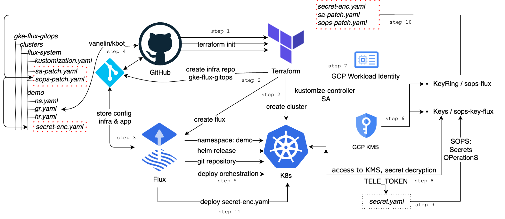

[](https://dashboard.infracost.io/org/vano3231/repos/a51f4d3f-031e-4131-8d26-c14214c62c21)

# List of modules that have been used:
- [Terraform Flux Bootstrap Git Module](https://github.com/den-vasyliev/tf-fluxcd-flux-bootstrap/tree/main)
- [GitHub Repository Terraform Module](https://github.com/den-vasyliev/tf-github-repository)
- [TLS Private Key Terraform Module](https://github.com/den-vasyliev/tf-hashicorp-tls-keys)
- [Google Kubernetes Engine (GKE) Cluster Terraform module](https://github.com/vanelin/tf-google-gke-cluster/tree/main)
- [Google Secret Manager for Terraform](https://github.com/GoogleCloudPlatform/terraform-google-secret-manager)
- [Google KMS Terraform Module](https://github.com/den-vasyliev/terraform-google-kms)

# Requirements

- [Install the terraform](https://developer.hashicorp.com/terraform/tutorials/aws-get-started/install-cli#install-terraform)

- [Install the fluxcd](https://fluxcd.io/flux/installation)

- [Create GitHub token:](https://docs.github.com/en/authentication/keeping-your-account-and-data-secure/managing-your-personal-access-tokens)

For personal access token (classic), I think the minimum I need for bootstrap to github is:
|         | 		   		   |		 							                          |
| ------: | :----------------- |:------------------------------------ |
| ✅      | `repo`             | Full control of private repositories |
| ✅      | `admin:public_key` | Full control of user public keys     |
|  		    |  		   		         |	    							                  |

- [Install the gcloud CLI](https://cloud.google.com/sdk/docs/install)
  - `gcloud auth login`
  - `gcloud auth application-default login`
- Add all sensitive varibles to `vars.tfvars` file, see `vars.tfvars.sample`.

# Infrastructure deployment to GKE



1. Edit the `vars.tfvars` file, specifying the necessary values in accordance with the configuration
2. Create a Google Storage Bucket:
```bash
$ gcloud storage buckets create gs://385711-bucket-tfstate --project=<PROJECT_ID> --default-storage-class=STANDARD --location=US --uniform-bucket-level-access
```
3. Clone repository
``` bash
$ git clone https://github.com/vanelin/tf-gcp-gke-cluster-flux.git
$ cd tf-gcp-gke-cluster-flux
```

4. Deploy a Kubernetes Cluster + Flux
```bash
 $ terraform init
 $ terraform validate
 $ terraform plan -var-file=vars.tfvars
 $ terraform apply -var-file=vars.tfvars

$ terraform state list
github_repository_deploy_key.deploy_key
module.flux_bootstrap.flux_bootstrap_git.this
module.gke-workload-identity.google_project_iam_member.workload_identity_sa_bindings["roles/cloudkms.cryptoKeyEncrypterDecrypter"]
module.gke-workload-identity.google_service_account.cluster_service_account[0]
module.gke-workload-identity.google_service_account_iam_member.main
module.gke_cluster.data.google_client_config.current
module.gke_cluster.data.google_container_cluster.main
module.gke_cluster.google_container_cluster.this
module.gke_cluster.google_container_node_pool.this
module.kms.google_kms_crypto_key.key_ephemeral[0]
module.kms.google_kms_key_ring.key_ring
module.tls_private_key.tls_private_key.this
module.gke_cluster.module.gke_auth.data.google_client_config.provider
module.gke_cluster.module.gke_auth.data.google_container_cluster.gke_cluster
module.gke-workload-identity.module.annotate-sa.module.gcloud_kubectl.data.external.env_override[0]
module.gke-workload-identity.module.annotate-sa.module.gcloud_kubectl.null_resource.additional_components[0]
module.gke-workload-identity.module.annotate-sa.module.gcloud_kubectl.null_resource.additional_components_destroy[0]
module.gke-workload-identity.module.annotate-sa.module.gcloud_kubectl.null_resource.run_command[0]
module.gke-workload-identity.module.annotate-sa.module.gcloud_kubectl.null_resource.run_destroy_command[0]
```

5. Fetch credentials for a running cluster.
```bash
$ gcloud container clusters get-credentials main --zone ${GOOGLE_REGION} --project ${GOOGLE_PROJECT}

```

6. Clone the infrastructure repository `flux-gitops`.
#### Example how to use flux:
```bash
# Clone the GitHub repository containing the Flux manifests
$ git clone https://github.com/${GITHUB_OWNER}/${FLUX_GITHUB_REPO}

# Change into the directory for the demo cluster and create a new directory for the namespace
$ cd ${FLUX_GITHUB_REPO}
$ mkdir clusters/demo && cd $_

# Create a Kubernetes Namespace for the demo
$ cat <<EOF > ns.yaml
apiVersion: v1
kind: Namespace
metadata:
  name: demo
EOF

# Create a GitRepository custom resource for the kbot repository
$ cat <<EOF > kbot-gr.yaml
---
apiVersion: source.toolkit.fluxcd.io/v1
kind: GitRepository
metadata:
  name: kbot
  namespace: demo
spec:
  interval: 1m0s
  ref:
    branch: main
  url: https://github.com/vanelin/kbot
EOF

# Create a HelmRelease custom resource for the kbot chart
$ cat <<EOF > kbot-hr.yaml
---
apiVersion: helm.toolkit.fluxcd.io/v2beta1
kind: HelmRelease
metadata:
  name: kbot
  namespace: demo
spec:
  chart:
    spec:
      chart: ./helm
      reconcileStrategy: ChartVersion
      sourceRef:
        kind: GitRepository
        name: kbot
  interval: 1m0s
EOF

# Commit the changes and push to the Git repository
$ git commit -am "Add kbot manifest" && git push

# Get a list of all the components managed by Flux and their status
$ flux get all
or
$ flux get all -A

# Get flux logs
$ flux logs

# Check flux component
kubectl get po -n flux-system
NAME                                       READY   STATUS    RESTARTS   AGE
helm-controller-8d775f7f6-f5v9f            1/1     Running   0          117m
kustomize-controller-7b97748758-qwqvl      1/1     Running   0          117m
notification-controller-7485f4b5dd-rdctt   1/1     Running   0          117m
source-controller-69db56c884-hq5w7         1/1     Running   0          117m


# Manual pass varible TELE_TOKEN to pod - `non-secure`
$ cat <<EOF > secret.yaml
apiVersion: v1
kind: Secret
metadata:
  name: kbot
type: Opaque
data:
  token: "<YOUR-TOKEN>"
EOF

$ kubectl apply -f secret.yaml

$ kubectl get po,secrets        
NAME                        READY   STATUS
pod/kbot-6bb874fd54-6jwhh   1/1     Running

NAME                                TYPE
secret/kbot                         Opaque
secret/sh.helm.release.v1.kbot.v1   helm.sh/release.v1
```
7. Let's add a safer way pass secret varible `TELE_TOKEN` to app.

After terraform apply modules:
- `gke-workload-identity`
- `kms`
```bash
# Get the Kubernetes ServiceAccount for the kustomize-controller in the flux-system namespace and display its annotations
$ kubectl get sa -n flux-system kustomize-controller -o yaml |grep -A5 annotation

# List the keys in the sops-flux-1 keyring located in the global location of Google Cloud KMS
$ gcloud  kms keys list --location global --keyring sops-flux-1

# Create a Kubernetes secret named "kbot" in the "demo" namespace, with a key-value pair "token"
$ kubectl -n demo create secret generic kbot --from-literal=token=$TELE_TOKEN --dry-run=client -o yaml > secret.yaml

# Encrypt the "secret.yaml" file using sops, specifying the GCP KMS key for encryption.
$ sops -e \
--gcp-kms projects/${{ secrets.GCP_PROJECT }}/locations/global/keyRings/sops-flux/cryptoKeys/sops-key-flux-1 \
--encrypted-regex '^(token)$' secret.yaml>secret-enc.yaml

# Create a patch file named "sa-patch.yaml" to add annotations to the kustomize-controller ServiceAccount in the flux-system namespace.
# The ServiceAccount will have an annotation "iam.gke.io/gcp-service-account".
# After add manifest please git push the changes to infra-repo

$ cat <<EOF > sa-patch.yaml
---
apiVersion: v1
kind: ServiceAccount
metadata:
  name: kustomize-controller
  namespace: flux-system
  annotations:
    iam.gke.io/gcp-service-account: kustomize-controller@${GOOGLE_PROJECT}.iam.gserviceaccount.com
EOF

# Create a patch file named "sops-patch.yaml" to configure decryption using sops in the flux-system Kustomization.
$ cat <<EOF > sops-patch.yaml
---
apiVersion: kustomize.toolkit.fluxcd.io/v1beta2
kind: Kustomization
metadata:
  name: flux-system
  namespace: flux-system
spec:
  interval: 10m0s
  path: ./clusters
  prune: true
  sourceRef:
    kind: GitRepository
    name: flux-system
  decryption:
    provider: sops
EOF

# Append the patch files "sops-patch.yaml" and "sa-patch.yaml" to the existing "kustomization.yaml" file
$ cat <<EOF >> kustomization.yaml
patches:
- path: sops-patch.yaml
  target:
    kind: Kustomization
- path: sa-patch.yaml
  target:
    kind: ServiceAccount
    name: kustomize-controller
EOF

# Stream the logs of the kustomize-controller pod in the flux-system namespace, showing the last 10 lines.
$ kubectl logs -n flux-system kustomize-controller-7b97748758-qwqvl -f --tail 10

# Get the Kubernetes ServiceAccount for the kustomize-controller in the flux-system namespace and display its annotations
$ kubectl get sa -n flux-system kustomize-controller -o yaml |grep -A6 annotation
  annotations:
    iam.gke.io/gcp-service-account: kustomize-controller@minikube-385711.iam.gserviceaccount.com
  creationTimestamp: "2023-06-19T16:53:51Z"
  labels:
    app.kubernetes.io/component: kustomize-controller
    app.kubernetes.io/instance: flux-system
    app.kubernetes.io/part-of: flux

# Add secret-enc.yaml to infra-repo and git push
# Check that kbot Running
$ kubectl -n demo get po,secrets -o wide
```
8. To automate token rotation, please refer to this repository >> [automation-token-update](https://github.com/vanelin/automation-token-update)

9. Destroy all infrastructure:
```bash
$ terraform destroy -var-file=vars.tfvars
```